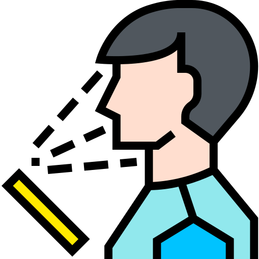

[![Contributors][contributors-shield]][contributors-url]
[![Forks][forks-shield]][forks-url]
[![Stargazers][stars-shield]][stars-url]
[![Issues][issues-shield]][issues-url]
[![MIT License][license-shield]][license-url]
[![LinkedIn][linkedin-shield]][linkedin-url]

<!-- PROJECT LOGO -->
<br />
<p align="center">
    

  <h2 align="center">Facial Recognition Dashboard</h2>

  <p align="center">
    A Weekend Project showing off Facial Recognition
    <br />
    <a href="http://ec2-52-66-232-128.ap-south-1.compute.amazonaws.com:5000/">View Demo</a>
    ·
    <a href="https://github.com/animikhaich/Facial-Recognition-Dashboard/issues/new">Report Bug</a>
    ·
    <a href="https://github.com/animikhaich/Facial-Recognition-Dashboard/issues/new">Request Feature</a>
  </p>
</p>


![Facial Recognition Dashboard Homepage][product-screenshot]

<!-- TABLE OF CONTENTS -->
## Table of Contents

- [Table of Contents](#table-of-contents)
- [About The Project](#about-the-project)
  - [Built With](#built-with)
    - [Frontend](#frontend)
    - [Backend](#backend)
    - [Deep Learning](#deep-learning)
- [Getting Started](#getting-started)
  - [Prerequisites](#prerequisites)
  - [Minimum Hardware Requirements](#minimum-hardware-requirements)
  - [Installation](#installation)
- [Usage](#usage)
- [Changelog](#changelog)
- [Roadmap](#roadmap)
- [Contributing](#contributing)
- [License](#license)
- [Contact](#contact)
    - [Animikh Aich](#animikh-aich)
- [Acknowledgements](#acknowledgements)


<!-- ABOUT THE PROJECT -->
## About The Project


A portfolio style dashboard to show Face Detection and Recognition in action. This is also my first attempt at a full-stack deployment of a Deep Learning based project. 

It does a few fundamental actions:
- The dashboard provides a UI for the user to interact with the underlying backend
- The pre-trained MTCNN based Face Detection detects faces and prompts the user to label them
- The pre-trained VGG Face extracts the facial features from the cropped faces
- When the user uploads the Query images, Detection and followed by Feature Extraction is done again for the query faces
- Finally, the similarity is between the labeled faces and the query faces are calculated using Cosine Distance Metric and the best match is displayed with a bounding box and name.

### Built With
Below are the languages, libraries and frameworks used for this project

#### Frontend
* [HTML](https://developer.mozilla.org/en-US/docs/Web/HTML)
* [CSS](https://developer.mozilla.org/en-US/docs/Web/CSS)
* [Bootstrap](https://getbootstrap.com)
* [JavaScript](https://developer.mozilla.org/en-US/docs/Web/JavaScript)

#### Backend
* [Python](https://www.python.org/)
* [Flask](https://palletsprojects.com/p/flask/)

#### Deep Learning
* [Keras](https://keras.io/)
* [Tensorflow](https://www.tensorflow.org/)


<!-- GETTING STARTED -->
## Getting Started

Running the code to start the web-server is fairly simple. You can easily follow the steps.

### Prerequisites

- [Python 3](https://www.python.org/)
- [Git Command Line](https://git-scm.com/)

### Minimum Hardware Requirements

- CPU: 2 Logical Cores (Threads)
- RAM: 4 GB
- Storage: 10 GB (Including Dependencies)
- OS: Linux, Windows, MacOS
- Internet: 2 Mbps

### Installation

1. Clone the repo
```sh
git clone https://github.com/animikhaich/Facial-Recognition-Dashboard.git
```
2. Install Python packages
```sh
pip install -r requirements.txt
```
3. Run the Flask Server
```sh
python app.py
```

<!-- USAGE EXAMPLES -->
## Usage

This was a weekend project for me. It's primary purpose is to serve as a demo of Facial Recognition. You can easily modify it as per your needs for a college project.

<!-- CHANGELOG -->
## Changelog

See the [Changelog](CHANGELOG.md).

<!-- ROADMAP -->
## Roadmap

See the [open issues](https://github.com/animikhaich/Facial-Recognition-Dashboard/issues?q=is%3Aopen) for a list of proposed features (and known issues).

<!-- CONTRIBUTING -->
## Contributing

Contributions are what make the open source community such an amazing place to be learn, inspire, and create. Any contributions you make are **greatly appreciated**.

1. Fork the Project
2. Create your Feature Branch (`git checkout -b feature/AmazingFeature`)
3. Commit your Changes (`git commit -m 'Add some AmazingFeature'`)
4. Push to the Branch (`git push origin feature/AmazingFeature`)
5. Open a Pull Request

<!-- LICENSE -->
## License

Distributed under the MIT License. See [LICENSE](LICENSE.md) for more information.

<!-- CONTACT -->
## Contact

#### Animikh Aich
- LinkedIn: [Animikh Aich](https://www.linkedin.com/in/animikh-aich/)
- Email: [animikhaich@gmail.com](mailto:animikhaich@gmail.com)
- Twitter: [@AichAnimikh](https://twitter.com/AichAnimikh)

Live Dashboard: [Facial Recognition dashboard](http://ec2-52-66-232-128.ap-south-1.compute.amazonaws.com:5000/)

<!-- ACKNOWLEDGEMENTS -->
## Acknowledgements
* [ipazc - MTCNN](https://github.com/ipazc/mtcnn)
* [rcmalli - Keras VGGFace](https://github.com/rcmalli/keras-vggface)


<!-- MARKDOWN LINKS & IMAGES -->
[contributors-shield]: https://img.shields.io/github/contributors/animikhaich/Facial-Recognition-Dashboard.svg?style=flat-square
[contributors-url]: https://github.com/animikhaich/Facial-Recognition-Dashboard/graphs/contributors
[forks-shield]: https://img.shields.io/github/forks/animikhaich/Facial-Recognition-Dashboard.svg?style=flat-square
[forks-url]: https://github.com/animikhaich/Facial-Recognition-Dashboard/network/members
[stars-shield]: https://img.shields.io/github/stars/animikhaich/Facial-Recognition-Dashboard.svg?style=flat-square
[stars-url]: https://github.com/animikhaich/Facial-Recognition-Dashboard/stargazers
[issues-shield]: https://img.shields.io/github/issues/animikhaich/Facial-Recognition-Dashboard.svg?style=flat-square
[issues-url]: https://github.com/animikhaich/Facial-Recognition-Dashboard/issues
[license-shield]: https://img.shields.io/github/license/animikhaich/Facial-Recognition-Dashboard.svg?style=flat-square
[license-url]: https://github.com/animikhaich/Facial-Recognition-Dashboard/blob/master/LICENSE.txt
[linkedin-shield]: https://img.shields.io/badge/-LinkedIn-black.svg?style=flat-square&logo=linkedin&colorB=555
[linkedin-url]: https://linkedin.com/in/animikh-aich/
[product-screenshot]: readme-assets/project-page.png